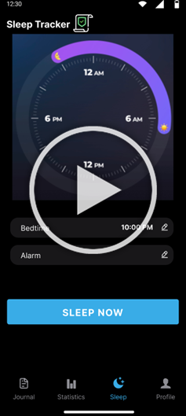
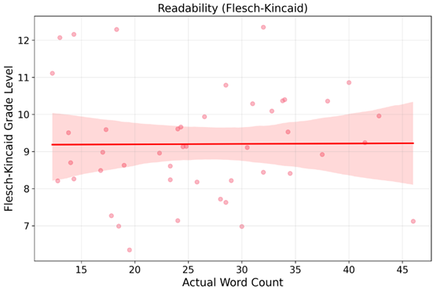
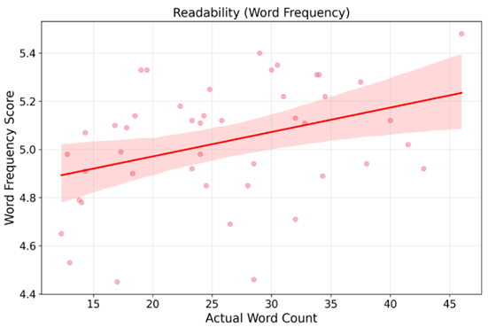
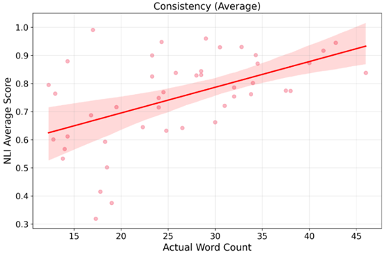
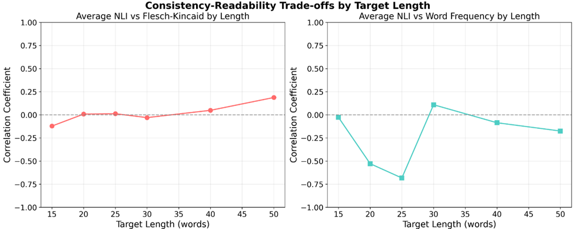

# AI-Driven Privacy Transparency for Mobile Health Applications

## Overview

This project addresses the critical disconnect between mobile health app users and privacy policies by developing an AI-powered system that provides real-time, easy-to-understand privacy explanations during app usage. The system detects privacy violations and translates complex legal language into accessible explanations that appear directly in the app interface.

## Background

Mobile healthcare applications have become integral to personal health management. These applications collect vast amounts of sensitive information through multiple channels including sensor data (microphone, accelerometer, gyroscope, light sensors etc), user-generated content (daily journals, medications, symptoms etc.), and behavioral patterns (screen time, usage habits).

Current healthcare applications utilize sophisticated data collection methods:

- **Passive sensor monitoring**: Continuous collection of environmental and physiological data through device sensors
- **Active user input**: Manual logging of health data
- **Integration with health platforms**: Synchronization with system-level health services like Apple Health or Google Fit
- **Third-party service integration**: Data sharing with analytics providers, advertising networks, and research partners

The complexity of modern data storage architectures further complicates privacy considerations. User data flows through multiple storage locations including local device storage, cloud-based backend servers managed by third-party providers (AWS, Azure), and integrated health platform infrastructures. Additionally, health data is quite valuable and is frequently shared with advertising networks, research institutions and other third parties. While privacy policies and privacy regulations exist, the technical complexity and lengthy legal documentation make it difficult for users to understand how their sensitive health information is being collected, processed, and shared.

## Problem Statement

Mobile health applications collect vast amounts of sensitive personal data, yet users rarely understand what they're consenting to:

- **Privacy policies are unreadable**: Most require college-level education to comprehend
- **Users don't read them**: Nearly everyone clicks "agree" without reading 10+ page legal documents
- **Hidden information**: Privacy details are buried deep in app settings
- **Real-time blindness**: Users are unaware of privacy violations occurring during app usage

This creates a situation where users technically "consent" to data collection practices they fundamentally don't understand.
Additionally, healthcare applications must comply with various privacy regulations, but users have limited visibility into how these regulations apply to their specific data.

## Objectives

This project centers on two interconnected research goals that work together to address the mobile health privacy transparency challenge:

### AI-Driven Privacy Detection and Explanation

The first major component involves using artificial intelligence to detect and explain privacy violations with respect to PIPEDA legislation, application privacy policies, and user consent configurations. This AI-driven approach provides several key benefits:

- **Real-time violation detection**: The system identifies privacy violations as they occur during data collection events, providing immediate awareness to users who would otherwise remain unaware of these issues
- **Contextual explanations**: AI generates easy-to-understand explanations that are specifically tailored to the data collection event that just occurred, making the information relevant and actionable
- **Regulatory compliance checking**: The system automatically checks data collection practices against PIPEDA legislation and the application's own privacy policy to identify inconsistencies and violations
- **Optimization research**: The project systematically measures the relationship between explanation length, readability, and logical consistency to optimize the effectiveness of AI-generated privacy communications for mobile interfaces

### Embedded Privacy User Interface

The second major component focuses on embedding privacy user interface and user experience elements directly within application screens rather than hiding them in settings menus:

- **Elimination of navigation barriers**: This approach fundamentally increases transparency by removing the need for users to navigate deep into applications to locate privacy policies, which are typically buried in settings menus or legal sections
- **Real-time privacy awareness**: The embedded system provides immediate privacy feedback during actual app usage, ensuring users understand the privacy implications of their actions as they occur
- **Dynamic feedback loop**: The user interface updates dynamically as soon as data collection occurs, creating an immediate connection between user actions and privacy consequences
- **Contextual integration**: Privacy information is presented within the context of the specific app functionality that triggers data collection, making it more relevant and understandable

## Methodology

### Prototype Development

A proof-of-concept sleep tracking application was developed to demonstrate the real-world applicability of the AI-driven privacy transparency system. The sleep tracking domain was strategically chosen because it naturally involves multiple types of data collection scenarios that are common in health applications.

#### Data Collection Types

The prototype implements several data collection scenarios that represent real-world health app functionality:

- **Sensor data collection**: The app collects data from microphones for ambient noise analysis during sleep, light sensors for room brightness monitoring, and accelerometer readings for movement detection and sleep phase identification
- **User input data**: Users provide sleep journal entries including daily mood assessments, habit tracking, sleep and wake times, and detailed diary entries about their sleep experience

A sample privacy policy was created which contains all information related to data collection for this application and was used as context for the AI generated explanations.

#### Real-Time Privacy Analysis System

The core system architecture operates through a structured workflow that ensures immediate privacy feedback:

- **Data collection detection**: When any data collection event occurs within the application, the system automatically captures comprehensive context information including the type of data being collected, the purpose of collection, where the data is being stored, whether it is encrypted and current user settings
- **LLM analysis**: The captured context is sent to Google's Gemini LLM along with relevant excerpts from the application's privacy policy, applicable PIPEDA principles, and the user's current consent configurations to provide comprehensive analysis context
- **Privacy assessment**: The LLM processes this information to detect and classify privacy violations, explain the purposes of data collection in user-friendly language, assess privacy risks associated with the data collection event, and determine compliance with regulatory requirements
- **UI updates**: The application interface updates in real-time with appropriate visual indicators and detailed explanations when privacy violations are detected, ensuring users receive immediate feedback about privacy implications

### Privacy User Interface

- **Figma Design System**: The linked Figma contains the initial wireframes for the core app, as well as different UI/UX ideas for privacy transparency. [Figma Link](https://www.figma.com/design/49HUNoDLrUx78XTzayYGG9/Sleep-Tracker-UI?node-id=80-5303&t=y4efP4qqNS29Ij3E-0)

#### Tooltip UI System

This approach provides contextual privacy information for individual data types:

- **Individual data type icons**: Privacy icons are placed directly next to each type of data being collected on a specific page, creating a clear visual connection between the data and its privacy implications
- **Contextual tooltips**: When users click on these icons, contextual tooltips appear with privacy information that is specifically relevant to that particular data type, including collection purpose, storage location, sharing arrangements, and any detected violations

#### Privacy Page UI System

This approach provides comprehensive privacy overviews for entire app screens:

- **Single screen-level icon**: A single privacy icon is strategically placed on each application screen, providing a centralized access point for privacy information related to that screen's functionality
- **Screen transformation**: When users click the privacy icon, the entire screen transforms into a comprehensive privacy page that displays privacy information for all data types collected on that particular screen

#### Dynamic Visual Feedback System

Both UI systems utilize a sophisticated visual feedback mechanism that provides immediate privacy risk assessment:

- **Major risk indicators (red icons)**: These represent clear violations of regulations, privacy policies, or user consent, including scenarios such as unauthorized data collection without proper consent, insecure storage or transmission of sensitive data, and sharing of data with third parties in violation of stated policies
- **Medium risk indicators (yellow icons)**: These indicate technically compliant but suboptimal privacy practices, such as vague or unclear purposes for data collection, excessive data collection that goes beyond what is necessary for stated app functionality, and concerning third-party sharing arrangements that may not violate policies but present privacy risks
- **Low risk indicators (green icons)**: These signify fully compliant practices with minimal privacy concerns, including clear and specific purposes for data collection, properly obtained user consent with transparent explanations, secure data handling practices that meet or exceed industry standards, and transparent data sharing arrangements

[](https://www.youtube.com/watch?v=k-5HXFbWKoI)

### Technical Details

More details can be found in the [docs directory](./docs/privacyUI.md)

This is the overall system architecture:


- The transparency module on the client side is responsible for gathering all the context about the data collection event that is occuring and sending it to the transparency module on the backend, where the LLM API is called to generate the explanations and determine privacy violations.
- The sensor module is an abstraction that allows for easy switching between real sensors and sensor simulators.
- Data can be stored locally or in the cloud (depending on user preference), and the PHI Storage API is the abstraction responsible for encapsulating that.

#### Frontend Architecture

- **React Native**: Selected for cross-platform mobile development to ensure consistent user experience across iOS and Android devices while maintaining native performance characteristics
- **Zustand**: Chosen for state management due to its lightweight nature, simplified API compared to Redux, and excellent performance characteristics for real-time UI updates
- **Expo framework**: Used to accelerate development and provide access to device sensors and native functionality without requiring extensive native development expertise

#### Backend Architecture

- **Express.js**: Selected as the API framework for its simplicity, extensive middleware ecosystem, and excellent compatibility with JavaScript-based development workflows
- **Firestore**: Chosen as the primary cloud database solution for its real-time capabilities, automatic scaling, and seamless integration with mobile applications requiring immediate data synchronization
- **JWT Authentication**: Implemented for secure user authentication and session management with token-based security

#### AI Integration

- **Google Gemini 2.5 Flash**: Selected as the primary LLM for privacy analysis due to its optimal balance of speed, performance, and cost-effectiveness for research purposes
- **Custom prompt engineering**: Developed specialized prompts that include complete privacy policy content, summarized PIPEDA regulations, transparency event data, and user consent configurations to ensure comprehensive analysis

#### Data Management

- **Expo SQLite**: Used for local storage of PHI, providing efficient querying capabilities
- **Expo SecureStore**: Implemented for secure storage of authentication tokens
- **React Native AsyncStorage**: Utilized for storing user consent configurations and application settings that need to persist across app sessions

## Evaluating the Prototype

After creating the prototype, it became essential to test its effectiveness. The ideal way to do this would be through user testing to test accuracy, readability and general value provided by the AI explanations as well as testing the effectiveness of the embedded UI elements. Since this was not possible due to resource and time constraints, the prototype would need to be tested through automated metrics. This is difficult to do for the UI/UX aspect of the prototype. Therefore, it was decided that the AI explanations would be evaluated through automated metrics.

One of the main objectives of the prototype is to provide easy to understand concise explanations of the privacy risks in the app with respect to the privacy policy and PIPEDA. The explanations should use terminology that the average person can understand. However, at the same time, the explanations must be logically consistent with the privacy policy and PIPEDA. It was important to ensure that the LLM was not hallucinating and not contradicting the reference texts as it generated these explanations.

Additionally, the explanations must be as concise as possible to both fit on mobile screens and encourage users to read them.

We want to investigate the relationship between logical consistency and readability at different lengths. Ideally, we want to find the shortest length where the text is both readable and logically consistent.

### Experimental Design

### Research Question

What is the relationship between readability and consistency with reference texts in AI-generated privacy explanations and how does response length influence this balance?

### Variables

**Independent Variable:**

- Response Length: 6 target word count levels (15, 20, 25, 30, 40, 50 words)

**Dependent Variables:**

_Readability Measures:_

- **Flesch-Kincaid Grade Level:**
  - Widely validated measure correlating with educational grade levels
  - Scores <9 considered readable for average Americans (8th grade reading level)
- **Word Frequency Score:**
  - Provides semantic complexity assessment beyond syntactic measures, with zipf scores representing real-world word usage patterns
  - Based on SUBTLEX-US database (1-7 scale), scores >5 considered readable

_Consistency Measures:_

- **Natural Language Inference (NLI):**
  - Determines the relationship between two pieces of text (the hypothesis and the premise)
  - It assesses whether the hypothesis logically follows from the premise (entailment), contradicts the premise or is unrelated (neutral), and gives a score from 0 - 1
  - This is not the perfect way to measure logical coherence, as our explanation will contain some text that is "unrelated" to the reference text, leading to more neutral scores.
  - However it is better than statisical based approaches that do not consider semantic meaning
  - Selected over LLM-based evaluation to avoid circular validation and ensure objective, reproducible consistency measurement
  - Using DeBERTa-v3-large-mnli-fever-anli-ling-wanli model from Hugging Face. This is one of the highest performing NLI models
- **Scoring thresholds:** ≥0.8 = supported (consistent), ≤0.2 = contradicted, 0.2-0.8 = neutral
  - It was difficult to find literature supporting thresholds for NLI, but I think these thresholds are reasonable.

### Test Cases and Procedure

- 8 different data collection scenarios representing various privacy violation types
- 6 response length targets per scenario
- **Total:** 48 test cases for comprehensive analysis

### LLM Configuration

Gemini 2.5 Flash model with optimized parameters:

```javascript
generationConfig: {
    temperature: 0.3,    // Consistent analysis
    topK: 40,           // Limit top candidate words
    topP: 0.95,         // 95% probability mass
    maxOutputTokens: 16384 // Adequate response space
}
```

### Main Analysis Prompt

This is the prompt that was chosen for this experiment. Future experiments can analyze how different prompts impact logical consistency and readability.

"Provide your analysis in clear, concise, user-friendly language that a non-technical person can understand. Replace complex legal and technical jargon with simple explanations that the average middle schooler can grasp."

### NLI Validation Process

1. **Privacy Policy Consistency:** Three explanation fields checked against relevant privacy policy sections
2. **PIPEDA Compliance:** Privacy violation explanations validated against applicable PIPEDA principles
3. The `privacyExplanation` field is supposed to explain if the app is violating any privacy principles and summarize the PIPEDA principles being violated. So this is checked against the most relevant PIPEDA principles for NLI. Since this field includes some info that is not going to be in any reference text, there is an expectation that there will be more neutral NLI scores.
4. **Composite Scoring:** Unweighted average of privacy policy and PIPEDA NLI scores
   - A weighted average by word count is not taken because I believe both are equally important.
5. **Readability Assessment:** Complete explanation text evaluated using both Flesch-Kincaid and word frequency metrics. The whole AIExplanation is used to check for readability using Flesch-Kincaid and word frequency. This is because the user will see all 4 fields and so all 4 fields together are part of the readability.

### Hypotheses

Preliminary testing was carried out using the ConTRoL dataset.

The `backend/ai-testing/sample-text-testing` directory contains the scripts used for this testing as well as the results.

While this testing is by no means comprehensive, it provides some initial guidance as to what the relationships are in sample text.

Below are the results from the initial testing:
| Correlation Pair | Correlation Value |
|:---|:---|
| Word Count vs. NLI Score | 0.162 |
| Word Count vs. Flesch-Kincaid Score | 0.267 |
| Word Count vs. Word Frequency Score | 0.290 |
| NLI Score vs. Word Frequency Score | -0.301 |
| NLI Score vs. Flesch-Kincaid Score | 0.316 |

Based on preliminary testing using the ConTRoL dataset, we hypothesized:

- **H1:** Higher consistency will be associated with lower readability
- **H2:** Higher consistency will be associated with greater response length
- **H3:** Higher readability will be associated with greater response length
- **H4:** Longer responses will weaken the negative relationship between readability and consistency

### Methodological Considerations

#### Model Selection Rationale

- **Gemini 2.5 Flash:** Chosen for optimal balance of speed, performance, and cost-effectiveness for research purposes

#### Limitations and Assumptions

- **Model Constraints:** Results specific to Gemini 2.5 Flash capabilities and may vary with other LLMs
- **NLI Limitations:** Legal texts vs explanations may yield more neutral scores due to indirect logical relationships
- **Scope:** Focused on English-language explanations within Canadian regulatory context (PIPEDA)

### Results

#### Overall Results from All Test Cases

- **Average NLI score:** 0.749
- **Average Flesch-Kincaid grade level:** 9.20
  - This means the AI generated explanations are at a grade 9-10 level, reasonably close to the average US reading level of approximately grade 8
- **Average Word Frequency zipf value:** 5.03
  - Above the threshold of 5
- This suggests that the explanations are generally readable for the average person
- The NLI score of 0.749 is lower than the threshold of 0.8, however since we expected more neutral scores due to the nature of the text we are testing and how NLI works, the explanations are generally consistent and not contradictory.

#### Correlations

- **Response length vs Flesch-Kincaid:** -0.007 (No correlation)
  - This is opposite of what we hypothesized (H3)

_Figure 1_



- **Response length vs Word frequency:** 0.365 (Weak positive correlation)
  - This is in line with H3

_Figure 2_



- **Response length vs NLI score:** 0.515 (Moderate positive correlation)
  - This is exactly as we hypothesized (H2)

_Figure 3_



### Detailed Analysis

_Figure 4_



According to the graph above, the correlation coefficient for NLI vs Flesch-Kincaid is close to 0 for all response lengths.

The correlation coefficient for NLI vs Word frequency is close to 0 for all response lengths except for 20 and 25 words, where the coefficient is -0.528 and -0.683 respectively, indicating moderate correlations (Figure 4). This means that for response lengths of 20 and 25 words, as logical consistency increases, readability decreases.

In general, our hypothesis that consistency and readability are inversely related is not supported by the results (H1). Hence, the hypothesis that this relationship would lessen as response length increases is also not supported (H4). Except for the negative relationship at 20-25 words for word frequency, consistency and readability have a correlation close to 0 for all lengths. And since there is no negative relationship for 20-25 words between NLI and Flesch-Kincaid, even that relationship is inconclusive.

Overall, the results suggest that increasing response length does increase logical consistency (Figure 3). However, the relationship between response length and readability is inconclusive with lots of variance in the data and conflicting correlations for Flesch-Kincaid and word frequency (Figures 1 and 2). Figures 1 and 2 suggest that readability is quite variable regardless of response length and so we were not able to find an ideal length where the text is reliably readable and consistent.

## Future Work

This research establishes important groundwork for AI-driven privacy transparency tools while highlighting several critical areas that require further investigation and development.

### User Testing and Validation

The most critical limitation of the current work is the gap between automated metrics and real user comprehension and trust:

- **Comprehensive user studies**: Future research must include extensive user testing to assess whether AI-generated explanations and embedded UI elements genuinely improve privacy transparency and user decision-making in real-world scenarios
- **Trust and comprehension measurement**: Studies should measure not only whether users can understand the explanations but whether the explanations increase their trust in the application and improve their privacy decision-making
- **Longitudinal effectiveness**: Research should examine whether the privacy transparency benefits persist over extended usage periods or whether users become desensitized to the privacy feedback

### Advanced Evaluation Methodologies

The experimental framework revealed several limitations in current evaluation approaches that require development of more sophisticated assessment methods:

- **Domain-specific readability metrics**: Future work should develop readability metrics that specifically account for the unique linguistic characteristics of privacy and legal content, as general-purpose metrics proved inadequate
- **Fine-tuned NLI models**: Development of Natural Language Inference models specifically trained on privacy policy and regulatory text could provide more accurate consistency assessments than general-purpose models
- **Rule-based consistency checking**: Exploration of rule-based methods for determining logical consistency between explanations and reference texts may provide more reliable assessment than purely machine learning-based approaches

The work contributes valuable insights to the emerging field of AI-powered regulatory transparency tools while demonstrating that significant work is needed to realize the full potential of such systems. The intersection of artificial intelligence, privacy regulation, and human-computer interaction presents rich opportunities for future research that could ultimately enhance privacy awareness and protection for mobile app users.

## Research Poster

This work was conducted as part of an undergraduate research project for the McMaster Center for Software Certification (McSCert) and was presented at the 2025 McMaster Undergraduate Research Fair. Here is the accompanying research poster. [View PDF](./Research_Poster.pdf)

## General Repository Structure

[More information](./backend/README.md) about the backend

[More information](./frontend/README.md) about the frontend

```
├── backend/
│   ├── ai-testing/                          # Experimental scripts and results
│   │   ├── trials.md                        # more details about the trials and observations
|   |   ├── consistency/                     # functions to measure logical consistency
│   |   ├── readability/                     # functions to measure readability
│   │   ├── test-results/                    # CSV files and graphs for all 12 trials
│   │   ├── sample-text-testing/             # scripts to test sample text as initial exploration
│   │   ├── evalAIExplanation.ts             # main script used to run the experiments
│   │   ├── analyze_data.py                  # python script to aggregate raw data, and create visualizations
│   │   ├── test-events.ts                   # contains the scenarios used for the experiments
│   └── src/                # Express.js API server
│       ├── config/                          # contains the firebase config files
│       ├── constants/                       # includes types
|       ├── repositories/                    # contains repository abstractions and firestore implementations
|       ├── routes/                          # api routes for storing PHI and generating AI explanations
|       ├── llm/                             # LLM abstraction and prompts
├── frontend/               # React Native mobile application
│   ├── app/
│   ├── components/                          # Reusable modals, transparency icons and other components
|   ├── assets/                              # includes fonts and images
│   ├── constants/                           # types, colors and config files
│   ├── services/                            # API integration, sensor, encryption and transparency services
│   |── store/                               # Zustand state management for auth, user profile and transparency events
│   ├── privacyPolicyData.json               # Privacy policy data for AI processing
│   └── privacyRegulations.json              # PIPEDA regulations data
├── docs/                   # Project documentation
│   ├── system_architecture.svg              # System architecture diagram
│   ├── privacyUI.md                         # Detailed documentation about the privacy UI and design decisions
|   ├── API.md                               # backend API docs
|   ├── prototype.md                         # Design considerations and limitations of the prototype
│   └── misc/                                # Additional documentation assets
└── Research_Poster.pdf                      # Academic research poster
```

## Usage

### Protototype

#### Prequisites

- Node.js
- React Native development environment
- Expo CLI
- Google Cloud account (for Gemini API access)
- Firebase account (for Firestore database)

#### Installation and Setup

#### Backend Setup

1. Navigate to the backend directory and install dependencies:

   ```bash
   cd backend
   npm install
   ```

2. Configure environment variables by creating a `.env` file with the following:

   ```
   GEMINI_API_KEY=your_gemini_api_key
   FIREBASE_SERVICE_ACCOUNT_KEY='{ "type": "...", ... , "private_key": "..." }' # Paste the entire JSON string on one line
   JWT_SECRET_KEY=your_jwt_secret_key
   ```

   - **Explanation of Variables:**

     - `GEMINI_API_KEY`: If you choose to use GEMINI - Obtain this from the Google Cloud Console. Otherwise you can use any LLM provider by extending the `LLMService` interface and obtaining the appropriate API key.
     - `FIREBASE_SERVICE_ACCOUNT_KEY`: The JSON service account key from your Firebase project. This key is necessary for the backend to interact with Firebase services (like Firestore). **Important:** Ensure you paste the entire JSON content of the key file into the `.env` file **on a single line**.

3. Start the development server:

   ```bash
   npm run dev
   ```

   The backend server will typically start on `http://localhost:7000` (or a similar port). Check the console output for the exact URL.

#### Frontend Setup

1. Navigate to the frontend directory and install dependencies:

   ```bash
   cd frontend
   npm install
   ```

2. Configure environment variables by creating a `.env` file with the following:

   ```
      EXPO_PUBLIC_API_UNENCRYPTED_URL=http://localhost:7000/api # If running locally
      # or
      EXPO_PUBLIC_API_ENCRYPTED_URL=URL_TO_DEPLOYED_APP # If using deployed backend
   ```

- **Explanation of Variables:** These two variables are required to demonstrate the encrypted in transit vs unencrypted in transit part of the data collection process.

3. Running the app:

There are two ways to run the frontend.

- **Using Expo Go**:

  - Expo Go is a sandbox environment for developing and testing React Native applications built with the Expo framework.
  - You must download the Expo Go app to your mobile device.

    ```bash
    npx expo start
    ```

    Scan the barcode in the console with your phone camera and this app will automatically open in the Expo Go app.

- **Using Android Emulator**:

  - **Prebuild the App:** This step prepares the project for building:

    ```bash
    npx expo prebuild
    ```

  - **Run the App on an Emulator:** Ensure you have an Android emulator installed and running. Then, run:

    ```bash
    npx expo run:android
    ```

While Expo Go is much quicker and easier to use than the Android emulator, it requires that the project use the latest Expo SDK, which is not going to be possible. Therefore, it is recommended to use the Android emulator to run the application.

### Running AI Experiments

The experimental framework can be executed to replicate the readability and consistency analysis:

1. Install dependencies:

   ```bash
   cd backend
   npm install
   ```

2. Navigate to the AI testing directory:

   ```bash
   cd ai-testing
   ```

3. Configure your Gemini API credentials in the .env file:

   ```bash
     GEMINI_API_KEY=your_gemini_api_key
   ```

4. Run the evaluation script:

   ```bash
   npx tsx evalAIExplation.ts
   ```

A raw data csv file will be created in the `test-results` directory

5. Run the python script to generate correlations and visualizations:

   ```bash
   python analyze_data.py [path_to_raw_data]
   ```

csv files of aggregated statistics and png files of visualizations will be created in the same directory as the raw data file
