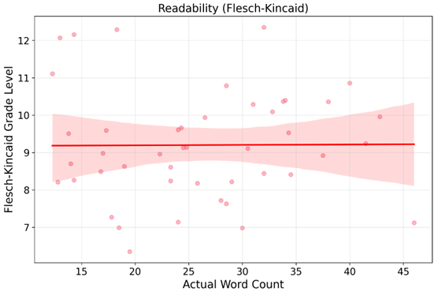
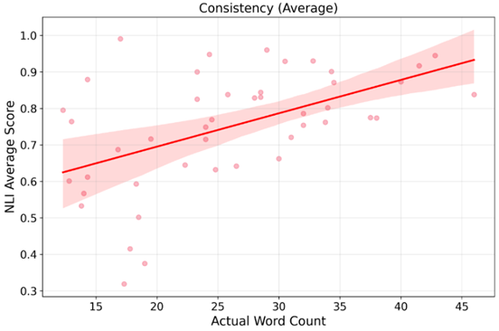
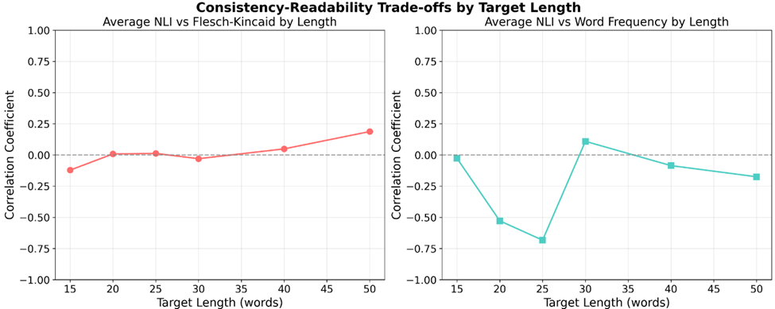

# Testing the Prototype

After creating the prototype, it became essential to test its effectiveness. The ideal way to do this would be through user testing to test accuracy, readability and general value provided by the AI explanations as well as testing the effectiveness of the embedded UI elements. Since this was not possible due to resource and time constraints, the prototype would need to be tested through automated metrics. This is difficult to do for the UI/UX aspect of the prototype. Therefore, it was decided that the AI explanations would be evaluated through automated metrics.

One of the main objectives of the prototype is to provide easy to understand concise explanations of the privacy risks in the app with respect to the privacy policy and PIPEDA. The explanations should use terminology that the average person can understand. However, at the same time, the explanations must be logically consistent with the privacy policy and PIPEDA. It was important to ensure that the LLM was not hallucinating and not contradicting the reference texts as it generated these explanations.

Additionally, the explanations must be as concise as possible to both fit on mobile screens and encourage users to read them.

We want to investigate the relationship between logical consistency and readability at different lengths. Ideally, we want to find the shortest length where the text is both readable and logically consistent.

## Experimental Design

### Research Question

What is the relationship between readability and consistency with reference texts in AI-generated privacy explanations and how does response length influence this balance?

### Variables

**Independent Variable:**

- Response Length: 6 target word count levels (15, 20, 25, 30, 40, 50 words)

**Dependent Variables:**

_Readability Measures:_

- **Flesch-Kincaid Grade Level:**
  - Widely validated measure correlating with educational grade levels
  - Scores <9 considered readable for average Americans (8th grade reading level)
- **Word Frequency Score:**
  - Provides semantic complexity assessment beyond syntactic measures, with zipf scores representing real-world word usage patterns
  - Based on SUBTLEX-US database (1-7 scale), scores >5 considered readable

_Consistency Measures:_

- **Natural Language Inference (NLI):**
  - Determines the relationship between two pieces of text (the hypothesis and the premise)
  - It assesses whether the hypothesis logically follows from the premise (entailment), contradicts the premise or is unrelated (neutral), and gives a score from 0 - 1
  - This is not the perfect way to measure logical coherence, as our explanation will contain some text that is "unrelated" to the reference text, leading to more neutral scores.
  - However it is better than statisical based approaches that do not consider semantic meaning
  - Selected over LLM-based evaluation to avoid circular validation and ensure objective, reproducible consistency measurement
  - Using DeBERTa-v3-large-mnli-fever-anli-ling-wanli model from Hugging Face. This is one of the highest performing NLI models
- **Scoring thresholds:** ≥0.8 = supported (consistent), ≤0.2 = contradicted, 0.2-0.8 = neutral
  - It was difficult to find literature supporting thresholds for NLI, but I think these thresholds are reasonable.

### Test Cases and Procedure

- 8 different data collection scenarios representing various privacy violation types
- 6 response length targets per scenario
- **Total:** 48 test cases for comprehensive analysis

### LLM Configuration

Gemini 2.5 Flash model with optimized parameters:

```javascript
generationConfig: {
    temperature: 0.3,    // Consistent analysis
    topK: 40,           // Limit top candidate words
    topP: 0.95,         // 95% probability mass
    maxOutputTokens: 16384 // Adequate response space
}
```

### Main Analysis Prompt

This is the prompt that was chosen for this experiment. Future experiments can analyze how different prompts impact logical consistency and readability.

"Provide your analysis in clear, concise, user-friendly language that a non-technical person can understand. Replace complex legal and technical jargon with simple explanations that the average middle schooler can grasp."

### NLI Validation Process

1. **Privacy Policy Consistency:** Three explanation fields checked against relevant privacy policy sections
2. **PIPEDA Compliance:** Privacy violation explanations validated against applicable PIPEDA principles
3. The `privacyExplanation` field is supposed to explain if the app is violating any privacy principles and summarize the PIPEDA principles being violated. So this is checked against the most relevant PIPEDA principles for NLI. Since this field includes some info that is not going to be in any reference text, there is an expectation that there will be more neutral NLI scores.
4. **Composite Scoring:** Unweighted average of privacy policy and PIPEDA NLI scores
   - A weighted average by word count is not taken because I believe both are equally important.
5. **Readability Assessment:** Complete explanation text evaluated using both Flesch-Kincaid and word frequency metrics. The whole AIExplanation is used to check for readability using Flesch-Kincaid and word frequency. This is because the user will see all 4 fields and so all 4 fields together are part of the readability.

### Hypotheses

Preliminary testing was carried out using the ConTRoL dataset.

The `sample-text-testing` directory contains the scripts used for this testing as well as the results.

While this testing is by no means comprehensive, it provides some initial guidance as to what the relationships are in sample text.

Below are the results from the initial testing:
| Correlation Pair | Correlation Value |
|:---|:---|
| Word Count vs. NLI Score | 0.162 |
| Word Count vs. Flesch-Kincaid Score | 0.267 |
| Word Count vs. Word Frequency Score | 0.290 |
| NLI Score vs. Word Frequency Score | -0.301 |
| NLI Score vs. Flesch-Kincaid Score | 0.316 |

Based on preliminary testing using the ConTRoL dataset, we hypothesized:

- **H1:** Higher consistency will be associated with lower readability
- **H2:** Higher consistency will be associated with greater response length
- **H3:** Higher readability will be associated with greater response length
- **H4:** Longer responses will weaken the negative relationship between readability and consistency

## Methodological Considerations

### Model Selection Rationale

- **Gemini 2.5 Flash:** Chosen for optimal balance of speed, performance, and cost-effectiveness for research purposes

### Limitations and Assumptions

- **Model Constraints:** Results specific to Gemini 2.5 Flash capabilities and may vary with other LLMs
- **NLI Limitations:** Legal texts vs explanations may yield more neutral scores due to indirect logical relationships
- **Scope:** Focused on English-language explanations within Canadian regulatory context (PIPEDA)

### Trials

#### Trial 1

The set up in this trial differed slightly from the set up explained above (which is the final set up). I had two instructions, one emphasized accuracy and one emphasized readability and I was comparing the two. I was also using a different model - Xenova/DeBERTa-v3-base-mnli.

- **Observations**: The actual word count that the AI outputs is not consistent with the length in the prompt. The readable prompt has longer responses.

To fix this, the following was added to the prompt to force the AI to generate responses between 80 - 100% of the requested length: `must be strictly between ${0.8 * length}-${length} words)`

#### Trial 2, 3, 4

These trials all had the same conditions. Now the problem of response length from Trial 1 was fixed.

- **Observations**: NLI scores for privacy policy indicated reasonable consistency, however NLI score for PIPEDA indicated neutrality or even contradiction. From all 3 readability metrics, the "accurate" prompt generates slightly less readable responses.

#### Trial 5, 6

Switched to the model mentioned in the experimental set up above: DeBERTa-v3-large-mnli-fever-anli-ling-wanli

- **Observations**: much better NLI scores overall for both privacy policy and PIPEDA. However, the NLI scores were quite similar between the "readable" and "accurate" prompts.
- I noticed that Coleman Liau is yielding significantly higher grade levels than Flesch-Kincaid. This may be because the metric normalizes per 100 words and our explanations are way shorter than that, potentially causing this metric to be less accurate. Therefore, it was decided to not use this metric for readability anymore.

#### Trial 7

I was noticing that the "readable" prompt and "accurate" prompt were not that different in terms of readability and even then the "readable" prompt still required a grade 11 reading level, which is above the American average.

So, I decided to test out how explicit of a prompt I would need to reduce the reading level. I tried the following prompt:
“Do not use complex words/jargon. Your explanations should be understandable by a 12-year-old.”

- **Observations**: The average grade level dropped down to about 8-9, and consistency remained similar as before.

#### Trial 8 and 9

I realized that there were too many variables making the analysis too complex. Since the main objective was to analyze the relationship between consistency and readability, instruction type was removed as a variable and only pne prompt was used (the main analysis prompt above).

These two trials were done as a preliminary test for this new approach with only 10-15 test cases, not the full 40.

#### Trial 10

Added the response length of 40 to the test cases to bridge the gap between 30 and 50, bringing the total number of test cases to 48.

#### Trial 11 and 12

Ran under the final conditions described in the setup above. Modified the code so that test cases where the Gemini LLM returned an error response were not part of the raw data.

Trial 11 was used for final results. But considering that the results for trial 12 do not match trial 11, the analysis below should be taken with a grain of salt. Because of the non-deterministic nature of LLM's, there is a lot of variability in the raw data and it is hard to establish the relationships that we are looking for. Metrics that take into account specific legal and technical jargon, rules based metrics, or finetuned NLI models should be considered in the future to make this analysis more robust.

## Final Results (Trial 11)

### Overall Results from All Test Cases

- **Average NLI score:** 0.749
- **Average Flesch-Kincaid grade level:** 9.20
  - This means the AI generated explanations are at a grade 9-10 level, reasonably close to the average US reading level of approximately grade 8
- **Average Word Frequency zipf value:** 5.03
  - Above the threshold of 5
- This suggests that the explanations are generally readable for the average person
- The NLI score of 0.749 is lower than the threshold of 0.8, however since we expected more neutral scores due to the nature of the text we are testing and how NLI works, the explanations are generally consistent and not contradictory.

### Correlations

- **Response length vs Flesch-Kincaid:** -0.007 (No correlation)
  - This is opposite of what we hypothesized (H3)

_Figure 1_



- **Response length vs Word frequency:** 0.365 (Weak positive correlation)
  - This is in line with H3

_Figure 2_


- **Response length vs NLI score:** 0.515 (Moderate positive correlation)
  - This is exactly as we hypothesized (H2)

_Figure 3_



### Detailed Analysis

_Figure 4_



According to the graph above, the correlation coefficient for NLI vs Flesch-Kincaid is close to 0 for all response lengths.

The correlation coefficient for NLI vs Word frequency is close to 0 for all response lengths except for 20 and 25 words, where the coefficient is -0.528 and -0.683 respectively, indicating moderate correlations (Figure 4). This means that for response lengths of 20 and 25 words, as logical consistency increases, readability decreases.

In general, our hypothesis that consistency and readability are inversely related is not supported by the results (H1). Hence, the hypothesis that this relationship would lessen as response length increases is also not supported (H4). Except for the negative relationship at 20-25 words for word frequency, consistency and readability have a correlation close to 0 for all lengths. And since there is no negative relationship for 20-25 words between NLI and Flesch-Kincaid, even that relationship is inconclusive.

Overall, the results suggest that increasing response length does increase logical consistency (Figure 3). However, the relationship between response length and readability is inconclusive with lots of variance in the data and conflicting correlations for Flesch-Kincaid and word frequency (Figures 1 and 2). Figures 1 and 2 suggest that readability is quite variable regardless of response length and so we were not able to find an ideal length where the text is reliably readable and consistent.
